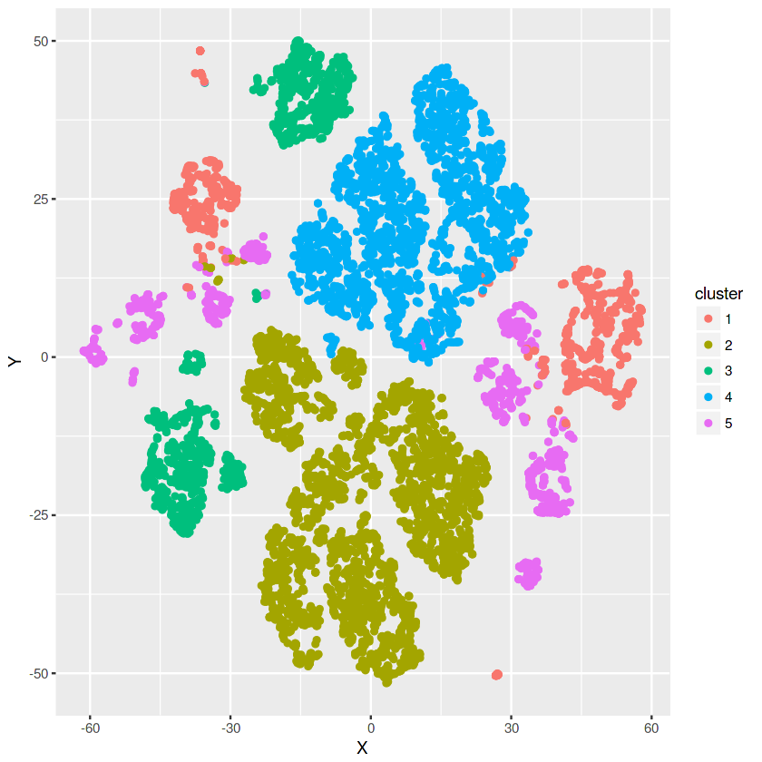
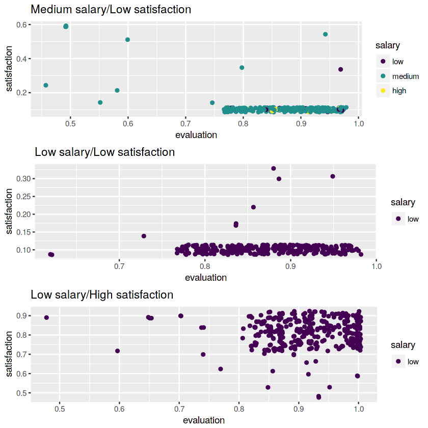
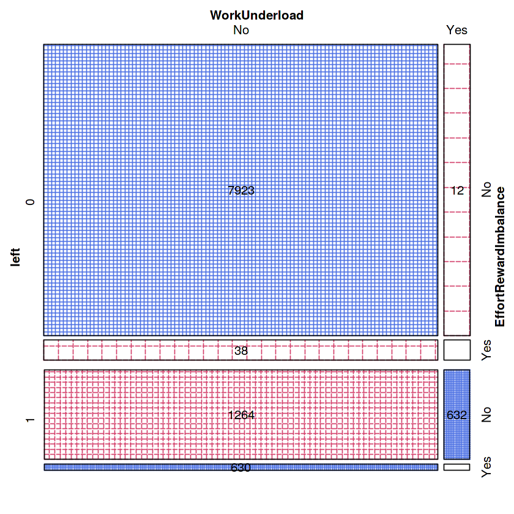

## Question ##
In this kernel, I'll try to answer the following question: 

 - Which are the groups of people who leave that could respond to some evidence-based HR interventions (policies, services, etc.)?

## Tools ##
I've tried to address this question using cluster analysis (with Gower's metric and partitioning around medoids). Visualization using a t-SNE plot was helpful in determining some subgroups as well. Please note that since the whole dataset (15k people) appears to be computationally intensive and my kernel constantly exceeded the memory capacity, I have reduced the original dataset by 30%. I also didn't use/show the silhouette width plot, since it was computationally intensive as well and I wasn't able to run the kernel (even only with the reduced set).

## Results ##
There are 2 clusters that stick out - both of them describe people who have left the company (most of them at least). I've only chosen clusters that could be well defined with concepts of HR or organisational psychology and that consist of several different variables, meaning they could be translated into actionable policies/moves in a simple and fast way. 

 - **"Effort-reward imbalance"** describes a group of overachieving people who have several projects on their hands, are working long hours and have been at the company for a rather long time but in most cases haven't received a promotion and their salary is mostly low or medium. Visual analysis showed that this group consists of two subgroups that could be interesting in the context of "no promotion" - 1) a group of workers with lower salaries who are dissatisfied, and 2) a group of workers with low salary who are satisfied with their condition ;
 -  **"Work underload"** describes a group of people who are new to the company, but who don't really have much to do in terms of projects as well as hours. They are relatively unsatisfied with their situation, and their performance is not that good either.  

## Actionable recommendations ##

As shown by the sieve plot at the end of this report, these two groups represent around 50% of all those who left. We can say that there is a potential to **increase our retention rate by ~10%** by undertaking the actions mentioned below. However, before the actual rollout other analyses (e.g. certain predictive analyses with cross-validation) would need to be done to see how good a model with these two variables would be at generalising to unseen data.

 - **Work reorganization**. On the one hand, there are quite some more experienced workers under heavy workload and on the other hand, there are newcomers with almost nothing on their hands. Try to identify tasks that could be delegated to newcomers, and identify more experienced workers who could benefit from being relieved of a certain amount of their workload. 
 - **Promotion policy**. Create or rewrite your promotion policy. Be aware that promotion doesn't only mean higher salary. There is a group of people who are satisfied with low salaries but who nevertheless leave. This may be due to the fact that they are seeking new challenges and underusing their skills. Try to articulate your policy in terms of promotion to more responsible positions or positions with higher symbolic value. Train the managers so that they will be capable of giving recognition to their workers by some tiny changes in their communication!
 - **Recruitment**. Speak to your recruitment team! They shouldn't be hiring people who are under- or overqualified for their job, which may result in people doing excellent work but not having enough challenges and leaving even though they are satisfied (or, on the other hand, in people underperforming). Moreover, the fact that there are several experienced and excellent workers could be due to the fact that they suffered from burnout. Your recruiters should pay attention to people who are not assertive (etc.) which may be a risk factor for burnout. 
 - **Underperformance team**. Create a team of coaches that could help managers address the underperformance issues! Work underload and corresponding low evaluations may not only be linked to simply not getting enough tasks. 

## In conclusion ##

All in all, I think this analysis shows that clustering can be a nice complement (or even alternative) to standard ways of exploring the data (e.g. visualization), especially if you are able to include the analysis of categorical variables by using the Gower's metric. 

Thanks for reading, and feel free to fork the kernel and develop it further!


```R
suppressMessages(library(dplyr))
suppressMessages(library(ggplot2))
suppressMessages(library(gridExtra))
suppressMessages(library(vcd))
suppressMessages(library(cluster))
suppressMessages(library(Rtsne))

hr <- read.csv("../input/HR_comma_sep.csv", stringsAsFactors = F)
colnames(hr) <- c("satisfaction", "evaluation", "projects", "hours", "tenure", "accident", "left", "promotion", "department", "salary")
hr$accident <- factor(hr$accident)
hr$left <- factor(hr$left)
hr$promotion <- factor(hr$promotion)
hr$salary <- ordered(hr$salary, c("low", "medium", "high"))
hr$department <- factor(hr$department)

set.seed(150555)

train <- sample_frac(hr, 0.7)
```

Note that I didn't use the "department" variable in determining the clusters. Why? Because 1) I've tried it before and since it has many categories this results in the number of clusters which is the same as the number of variables, 2) we cannot really say that a "department" is a priori part of a certain concept (there is no department that is naturally under more stress than others), 3) you can always check the frequency of certain groups within the departments afterwards.


```R
gowerd <- daisy(train[,-9], metric = "gower")
```

Using the silhouette width criteria, the optimal number of clusters is 5 (you can check it yourself on your PC, however it may take up to 10-15 minutes). The exact number for 5 clusters is .351, which is not terribly good but not indicative of complete lack of separation either.


```R
clusterfit <- pam(gowerd, diss = T, k = 5)
```

Below you can see that clusters one and five are the only ones who describe those who left, and they also appear to be the most homogenous in terms of how many individuals within them have extreme - either low or high - values. 

There is also one cluster which seems to consist of people who had an accident and decided to stay nevertheless. However, there's not much more information in this and I'm not sure how to interpret it, so we won't use this cluster in our interpretation - and neither I will use the remaining two, since they mainly describe the difference in salaries.


```R
clusters <- train %>% 
            mutate(cluster = clusterfit$clustering) %>% 
            group_by(cluster) %>% 
            do(allclusters = summary(.))

clusters$allclusters
```


    [[1]]
      satisfaction      evaluation        projects         hours      
     Min.   :0.1000   Min.   :0.3700   Min.   :2.000   Min.   : 98.0  
     1st Qu.:0.3800   1st Qu.:0.4800   1st Qu.:2.000   1st Qu.:135.0  
     Median :0.4100   Median :0.5100   Median :2.000   Median :145.0  
     Mean   :0.4156   Mean   :0.5196   Mean   :2.092   Mean   :147.7  
     3rd Qu.:0.4400   3rd Qu.:0.5500   3rd Qu.:2.000   3rd Qu.:154.0  
     Max.   :0.8900   Max.   :1.0000   Max.   :6.000   Max.   :301.0  
                                                                      
         tenure      accident left     promotion      department     salary   
     Min.   :2.000   0:1131   0:  11   0:1177    sales     :369   low   :741  
     1st Qu.:3.000   1:  56   1:1176   1:  10    technical :208   medium:410  
     Median :3.000                               support   :172   high  : 36  
     Mean   :3.054                               IT        : 82               
     3rd Qu.:3.000                               hr        : 81               
     Max.   :6.000                               accounting: 76               
                                                 (Other)   :199               
        cluster 
     Min.   :1  
     1st Qu.:1  
     Median :1  
     Mean   :1  
     3rd Qu.:1  
     Max.   :1  
                
    
    [[2]]
      satisfaction      evaluation        projects         hours    
     Min.   :0.1200   Min.   :0.3600   Min.   :2.000   Min.   : 96  
     1st Qu.:0.5400   1st Qu.:0.5800   1st Qu.:3.000   1st Qu.:161  
     Median :0.6900   Median :0.7200   Median :4.000   Median :198  
     Mean   :0.6679   Mean   :0.7158   Mean   :3.785   Mean   :199  
     3rd Qu.:0.8400   3rd Qu.:0.8500   3rd Qu.:4.000   3rd Qu.:238  
     Max.   :1.0000   Max.   :1.0000   Max.   :6.000   Max.   :296  
                                                                    
         tenure      accident left     promotion       department     salary    
     Min.   : 2.00   0:3661   0:3645   0:3535    sales      :991   low   :   0  
     1st Qu.: 2.00   1:   0   1:  16   1: 126    technical  :580   medium:2991  
     Median : 3.00                               support    :534   high  : 670  
     Mean   : 3.46                               IT         :314                
     3rd Qu.: 4.00                               management :252                
     Max.   :10.00                               product_mng:219                
                                                 (Other)    :771                
        cluster 
     Min.   :2  
     1st Qu.:2  
     Median :2  
     Mean   :2  
     3rd Qu.:2  
     Max.   :2  
                
    
    [[3]]
      satisfaction      evaluation        projects         hours      
     Min.   :0.1200   Min.   :0.3600   Min.   :2.000   Min.   : 96.0  
     1st Qu.:0.5400   1st Qu.:0.5800   1st Qu.:3.000   1st Qu.:161.8  
     Median :0.6850   Median :0.7200   Median :4.000   Median :202.0  
     Mean   :0.6703   Mean   :0.7151   Mean   :3.803   Mean   :200.4  
     3rd Qu.:0.8400   3rd Qu.:0.8600   3rd Qu.:4.000   3rd Qu.:240.0  
     Max.   :1.0000   Max.   :1.0000   Max.   :6.000   Max.   :287.0  
                                                                      
         tenure       accident left     promotion       department     salary   
     Min.   : 2.000   0:   0   0:1390   0:1355    sales      :373   low   :636  
     1st Qu.: 2.000   1:1412   1:  22   1:  57    technical  :252   medium:648  
     Median : 3.000                               support    :213   high  :128  
     Mean   : 3.489                               IT         :112               
     3rd Qu.: 4.000                               product_mng: 94               
     Max.   :10.000                               marketing  : 88               
                                                  (Other)    :280               
        cluster 
     Min.   :3  
     1st Qu.:3  
     Median :3  
     Mean   :3  
     3rd Qu.:3  
     Max.   :3  
                
    
    [[4]]
      satisfaction      evaluation        projects         hours      
     Min.   :0.1200   Min.   :0.3600   Min.   :2.000   Min.   : 96.0  
     1st Qu.:0.5400   1st Qu.:0.5900   1st Qu.:3.000   1st Qu.:162.0  
     Median :0.6900   Median :0.7100   Median :4.000   Median :197.0  
     Mean   :0.6708   Mean   :0.7156   Mean   :3.783   Mean   :198.3  
     3rd Qu.:0.8400   3rd Qu.:0.8500   3rd Qu.:4.000   3rd Qu.:236.8  
     Max.   :1.0000   Max.   :1.0000   Max.   :6.000   Max.   :287.0  
                                                                      
         tenure       accident left     promotion       department     salary    
     Min.   : 2.000   0:2918   0:2918   0:2888    sales      :796   low   :2918  
     1st Qu.: 2.000   1:   0   1:   0   1:  30    technical  :567   medium:   0  
     Median : 3.000                               support    :426   high  :   0  
     Mean   : 3.227                               IT         :244                
     3rd Qu.: 4.000                               product_mng:195                
     Max.   :10.000                               marketing  :167                
                                                  (Other)    :523                
        cluster 
     Min.   :4  
     1st Qu.:4  
     Median :4  
     Mean   :4  
     3rd Qu.:4  
     Max.   :4  
                
    
    [[5]]
      satisfaction      evaluation        projects        hours      
     Min.   :0.0900   Min.   :0.4500   Min.   :2.00   Min.   :132.0  
     1st Qu.:0.1000   1st Qu.:0.8400   1st Qu.:5.00   1st Qu.:243.0  
     Median :0.3500   Median :0.9000   Median :5.00   Median :259.0  
     Mean   :0.4548   Mean   :0.8877   Mean   :5.39   Mean   :258.8  
     3rd Qu.:0.8200   3rd Qu.:0.9500   3rd Qu.:6.00   3rd Qu.:278.0  
     Max.   :0.9200   Max.   :1.0000   Max.   :7.00   Max.   :310.0  
                                                                     
         tenure      accident left     promotion       department     salary   
     Min.   :2.000   0:1281   0:   9   0:1319    sales      :363   low   :804  
     1st Qu.:4.000   1:  40   1:1312   1:   2    technical  :293   medium:492  
     Median :5.000                               support    :206   high  : 25  
     Mean   :4.594                               IT         :107               
     3rd Qu.:5.000                               product_mng: 79               
     Max.   :8.000                               accounting : 67               
                                                 (Other)    :206               
        cluster 
     Min.   :5  
     1st Qu.:5  
     Median :5  
     Mean   :5  
     3rd Qu.:5  
     Max.   :5  
                
    


Let's explore the clusters in more detail. It seems that clusters one and five are scattered around a bit because of their variation in two variables (salary and satisfaction). I'm primarily interested in cluster five, since these are the people who deserve the promotion, but we're not sure whether this would need to involve a raise or something else.


```R
tsne <- Rtsne(gowerd, is_distance = T)

tsned <- tsne$Y %>%
        data.frame() %>%
        setNames(c("X", "Y")) %>%
        mutate(cluster = factor(clusterfit$clustering), id = row.names(train))

ggplot(aes(x = X, y = Y), data = tsned) + 
        geom_point(aes(color = cluster))
```





Below you will see some graphs that explore the cluster number five in more detail. It seems that there is a group of people with low salary who do not really care about the raise (they could instead be promoted to a more responsible position or a position with more symbolic value), and the other groups in which the promotion could also involve a raise.


```R
train$id <- row.names(train)

subcluster5_1 = tsned %>%
                filter(X > -65 & X < -45, Y > -5 & Y < 13) %>%
                left_join(train, by = "id")

g1 <- ggplot(subcluster5_1, 
             aes(x = evaluation, y = satisfaction, color = salary)) + 
             geom_jitter() + 
             ggtitle("Medium salary/Low satisfaction")
```


```R
subcluster5_2 = tsned %>%
                filter(Y < -13, Y > -40, X > 30 ) %>%
                left_join(train, by = "id") 

g2 <- ggplot(subcluster5_2, 
             aes(x = evaluation, y = satisfaction, color = salary)) + 
             geom_jitter() + 
             ggtitle("Low salary/Low satisfaction")
```


```R
subcluster5_3 = tsned %>%
                filter(Y > -13, Y < 10, X > 25 & X < 35 ) %>%
                left_join(train, by = "id") 

g3 <- ggplot(subcluster5_3, 
             aes(x = evaluation, y = satisfaction, color = salary)) + 
             geom_jitter() + 
             ggtitle("Low salary/High satisfaction")
```


```R
grid.arrange(g1, g2, g3)
```





Based on the summary of our clusters, I will create new variables based on different variables that were shown to be specific for some of our clusters. For instance, in our cluster number 5 we can see that 75% of people had an evaluation score 0.84 or above. Such a departure from the population's mean tells us that this group is highly performing. 

Together with the other variables - with similarly extreme values - from our summary, we can see that there are other characteristics of this group, such as many projects, working a lot, but mostly no promotion at all. This is why we will call this variable Effort-reward imbalance, and similar reasoning is behind our creation of the Work underload variable. 


```R
train$EffortRewardImbalance <- "No"
train$EffortRewardImbalance[train$evaluation >= .84 & train$projects >= 5 & train$hours >= 243 & train$tenure >= 4 & train$promotion == 0] <- "Yes"
train$WorkUnderload <- "No"
train$WorkUnderload[train$satisfaction <= .44 & train$evaluation <= .55 & train$projects == 2 & train$hours <= 154 & train$tenure <= 3 & train$promotion == 0] <- "Yes"
train$EffortRewardImbalance <- factor(train$EffortRewardImbalance)
train$WorkUnderload <- factor(train$WorkUnderload)
```

Below is the sieve plot which can help us see how many employees belong to one of the categories we created. We can see that these categories (Effort-reward imbalance and Work underload) together describe around 50% of those who left.

I prefer the sieve plot because in contrast to the mosaic plot it has a built-in function (in the "vcd" package) of displaying actual numbers of people within the groups.


```R
sieve(Freq ~ 
      WorkUnderload + EffortRewardImbalance | left, 
      data = train, 
      labeling = labeling_values, 
      shade = T, 
      scale = 1)
```




