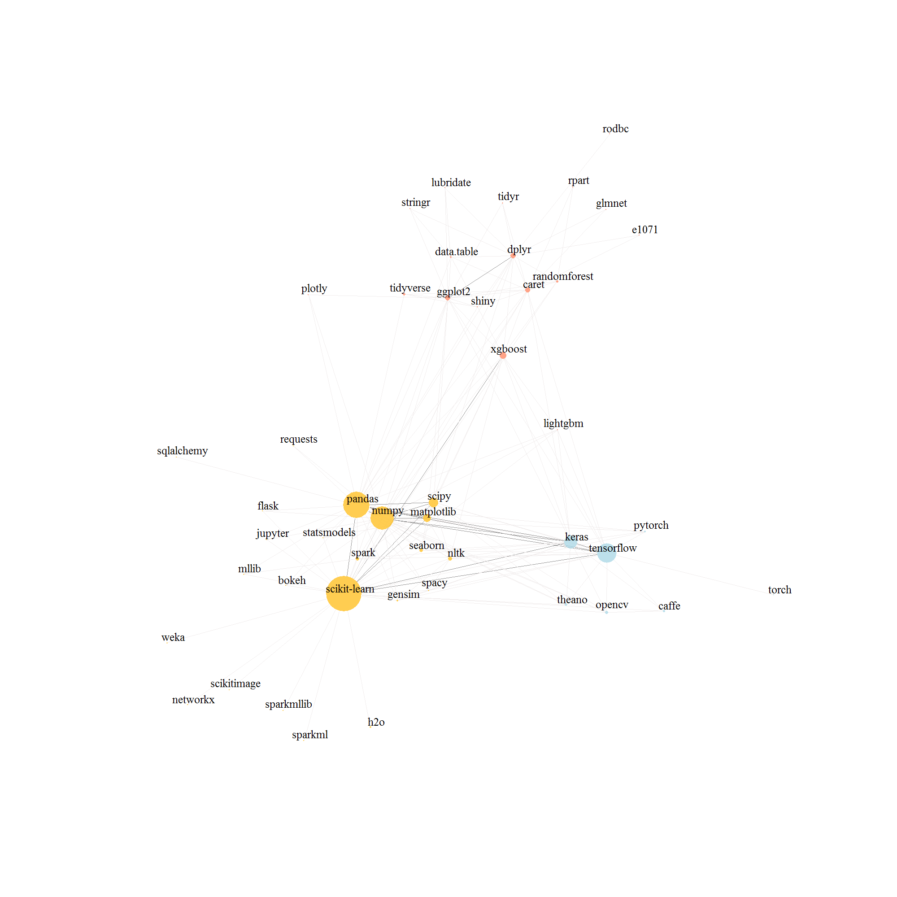
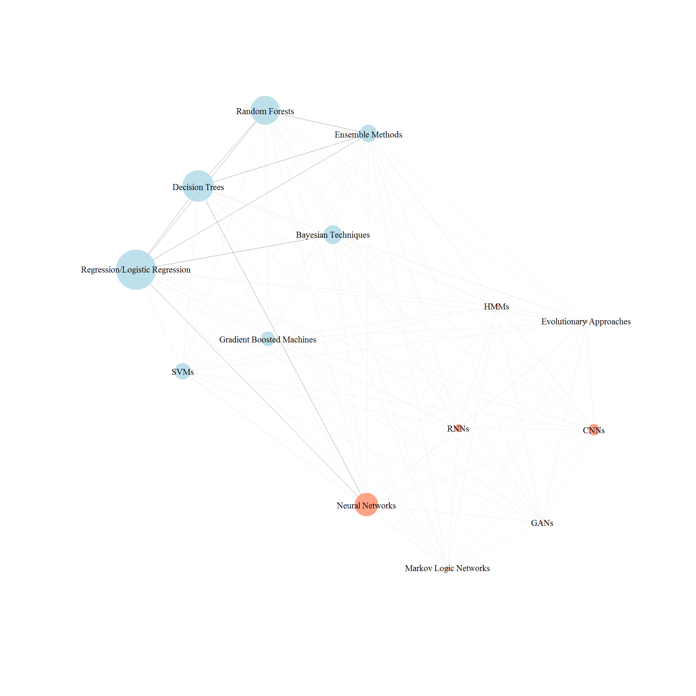
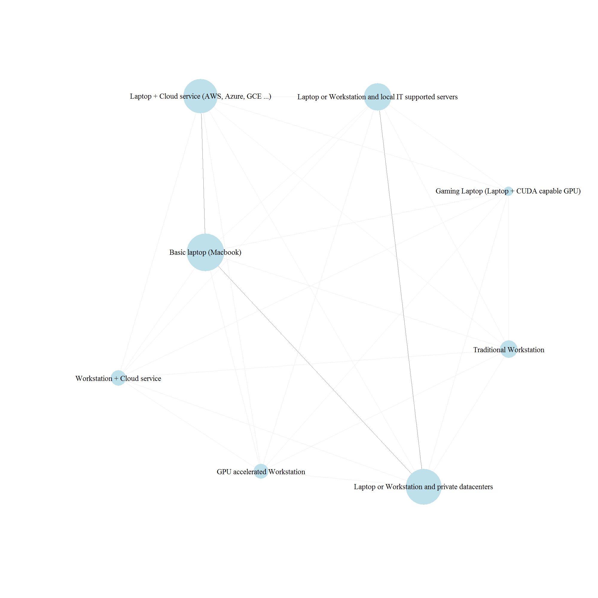
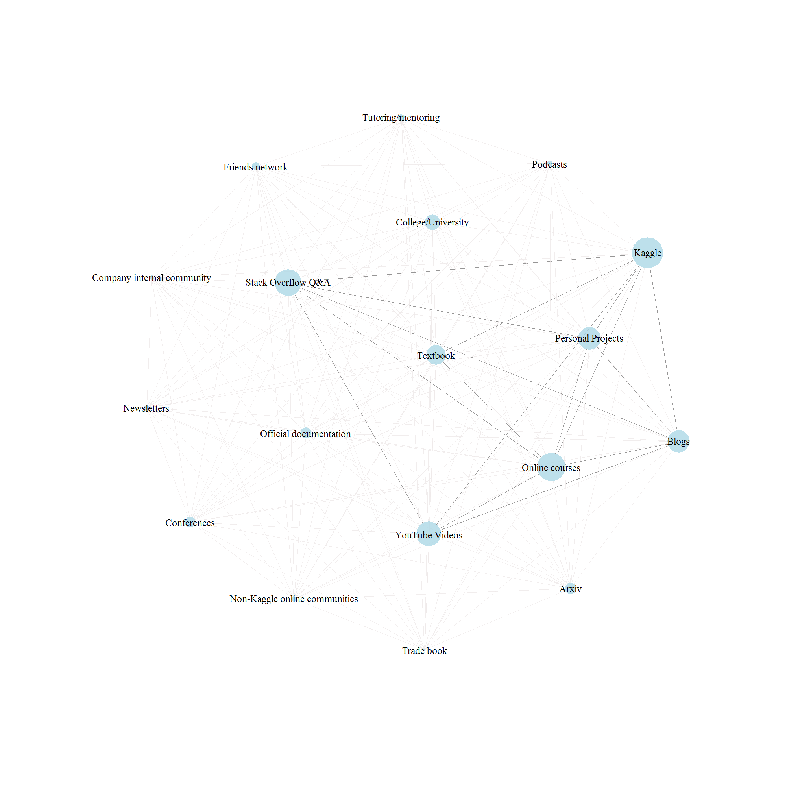

Intro
=====

The purpose of this kernel is to **take a look at the tools, devices &
learning platforms that were most frequently used by Kagglers in 2017.**

I will use network graphs as implemented in the `igraph` package. There
are three simple reasons for that.

By using these graphs, we can:

-   Already plot the frequency of use & grasp the most visible
    differences;

-   Try to find clusters of different tools/devices/platforms;

-   Highlight the most common co-occurences.

Let's start.

Preparations
============

Loading libraries
-----------------

`dplyr` & `tidyr` will be more than enough for data cleaning purposes,
and `igraph` is essential for plotting the network graphs.

    library(dplyr)

    library(tidyr)

    library(igraph)

Loading data
------------

We will only use the files with responses. In most cases, the
abbreviated versions of the original questions are indicative enough.

In the *multiple choice responses file* we will analyse work tools,
algorithms, hardware & learning platforms, and in the *free form
responses file* we will focus on libraries used at work.

    mlch <- read.csv("C:/Users/aljaz_000/Desktop/multipleChoiceResponses.csv", header = TRUE, stringsAsFactors = FALSE) %>% 

    select(WorkToolsSelect, WorkAlgorithmsSelect, WorkHardwareSelect, LearningPlatformSelect, MLTechniquesSelect)

    freeform <- read.csv("C:/Users/aljaz_000/Desktop/freeformResponses.csv", header = TRUE, stringsAsFactors = FALSE) %>% 

    select(WorkLibrariesFreeForm)

Data structure preview
======================

Let's see how our data is structured. Most of the columns that we'll
analyze are structured in this way - several values per row, all
separated with - in most cases - a comma.

There are also empty rows; this means there was no response. In our
`read.csv` approach this wasn't transformed to `NA`, but the functions
developed later will handle this.

    kable(head(mlch %>% select(WorkToolsSelect)))

<table>
<colgroup>
<col width="100%" />
</colgroup>
<thead>
<tr class="header">
<th align="left">WorkToolsSelect</th>
</tr>
</thead>
<tbody>
<tr class="odd">
<td align="left">Amazon Web services,Oracle Data Mining/ Oracle R Enterprise,Perl</td>
</tr>
<tr class="even">
<td align="left"></td>
</tr>
<tr class="odd">
<td align="left"></td>
</tr>
<tr class="even">
<td align="left">Amazon Machine Learning,Amazon Web services,Cloudera,Hadoop/Hive/Pig,Impala,Java,Mathematica,MATLAB/Octave,Microsoft Excel Data Mining,Microsoft SQL Server Data Mining,NoSQL,Python,R,SAS Base,SAS JMP,SQL,Tableau</td>
</tr>
<tr class="odd">
<td align="left">C/C++,Jupyter notebooks,MATLAB/Octave,Python,R,TensorFlow</td>
</tr>
<tr class="even">
<td align="left">Jupyter notebooks,Python,SQL,TensorFlow</td>
</tr>
</tbody>
</table>

Creating useful functions
=========================

In order to plot a network graph, we need the data to be structured in a
specific way - and certainly not as the raw data we usually obtain from
surveys.

We need two elements:

-   A dataframe with **edges** - these are basically different links
    between the values you are analyzing. You can also assign a specific
    weight to each one of them;

-   A dataframe with **nodes (or vertices)** - this contains information
    about different values, e.g. information about the frequency of the
    value, to which category it belongs, etc.; all this can be used for
    plotting & presenting the data in a particular way.

This is why it is useful to create some functions that will help us plot
such datasets & their variables quickly & efficiently.

**Note:**

-   The functions below are for *undirected* graphs. Meaning that e.g. a
    link between Python and R is stored only once (e.g. as "Python -
    R"), and there is no distinction between e.g. "Python - R" and "R -
    Python";

-   For the first two functions described below you will need to have
    `dplyr` and `tidyr` loaded;

-   The functions have not been tested on other datasets, so they may
    need minor modifications if used elsewhere - depending on the
    specifics of a survey/file.

Create the edges
----------------

The first function we'll create will be called `to_edges`, since it will
create a dataframe with information about edges. You need to pass at
least two elements to this function - your dataframe and the variable
you want to transform and later plot as network.

By default, it can transform the files that use commas as separators,
but you can change this in the usual `sep` argument. Furthermore, you
can specify the values you want to get rid of in `get_rid_of argument`.
This is used to get rid of some non-specific values, such as `Other`, or
- in the case of Kaggle survey - also
`Other (please specify; separate by semi-colon)`. You can freely pass
any value here, but as default it will use the ones used in the Kaggle
survey.

The function also keeps the enumerations within enumerations intact.
This makes sure that items such as `Cloud service (AWS, Azure, GCE ...)`
remain untouched, i.e. that AWS, Azure, GCE are not split & do not go
into a new row. The same would be true if we would have semicolons as
delimiters inside the parentheses.

    to_edges <- function(df, variable, sep = ",", get_rid_of = c("Other", "Other (please specify; separate by semi-colon)")) {

      

      df %>%

        select(variable) %>%

        # Filter out missing values (either stored as blank fields or NA)

        filter(!is.na((.)[[variable]]) & !(.)[[variable]] == "") %>%

        # Create the ID for each respondent, so that we only obtain combinations of e.g. tools per each person

        mutate(ID = row_number(), 

        # Split the items by the chosen delimiter. Commas or semicolons in parentheses are not taken into account

               !!variable := strsplit(as.character((.)[[variable]]), 

                                      split = paste("\\([^)]+(,|;)(*SKIP)(*FAIL)|", sep, "\\s*", 

                                      sep = ""), perl = TRUE)) %>%

        # Place each element into a new row

        unnest_(variable) %>%

        # Filter out the specified values which you want to get rid of

        filter(!(.)[[variable]] %in% get_rid_of) %>%

        # Per each ID, create 2 columns which represent unique & undirected combinations of items

        group_by(ID) %>%

        filter(n()>=2) %>%

        do(data.frame(t(combn((.)[[variable]], 2)), stringsAsFactors=FALSE)) %>% ungroup() %>%

        # Add count of different combinations to the dataset

        add_count(X1, X2) %>% rename(source = X1, target = X2, weight = n) %>%

        # Calculate weight as the proportion of total number of combinations

        mutate(weight = weight / n()) %>% select(-ID) -> edges_df

               

        return(edges_df)

               

    }

You can see below how the transformed dataframe looks like.

We're removing the duplicates when applying the function, since I
haven't put the removal of the duplicates in the default; sometimes it
may be useful to keep all the combinations, even the duplicate ones.

The default weights assigned by the function are basically the
frequencies of co-occurences - but you can change this later at any
point before creating an igraph object.

You can already see some of the most common links, with **the most
frequent connection being between Python and R**.

    edges_tool <- to_edges(mlch, "WorkToolsSelect") %>% distinct()

    kable(head(edges_tool %>% arrange(desc(weight))))

<table>
<thead>
<tr class="header">
<th align="left">source</th>
<th align="left">target</th>
<th align="right">weight</th>
</tr>
</thead>
<tbody>
<tr class="odd">
<td align="left">Python</td>
<td align="left">R</td>
<td align="right">0.0241401</td>
</tr>
<tr class="even">
<td align="left">Python</td>
<td align="left">SQL</td>
<td align="right">0.0228785</td>
</tr>
<tr class="odd">
<td align="left">Jupyter notebooks</td>
<td align="left">Python</td>
<td align="right">0.0210646</td>
</tr>
<tr class="even">
<td align="left">R</td>
<td align="left">SQL</td>
<td align="right">0.0192984</td>
</tr>
<tr class="odd">
<td align="left">Python</td>
<td align="left">TensorFlow</td>
<td align="right">0.0147841</td>
</tr>
<tr class="even">
<td align="left">Jupyter notebooks</td>
<td align="left">SQL</td>
<td align="right">0.0135021</td>
</tr>
</tbody>
</table>

Create the nodes
----------------

Next step is creating the function for creating the nodes dataframe - we
will call it `to_nodes`.

The structure is quite similar to the `to_edges` function with the same
arguments, except that it returns the names of the values used in the
edges dataframe and their respective size (frequencies).

    to_nodes <- function(df, variable, sep = ",", get_rid_of = c("Other", "Other (please specify; separate by semi-colon)")) {

      

      df %>%

        select(variable) %>%

        # Filter out missing values (either stored as blank fields or NA)

        filter(!is.na((.)[[variable]]) & !(.)[[variable]] == "") %>%

        # Split the items by the chosen delimiter. Commas or semicolons in parentheses are not taken into account

        mutate(!!variable := strsplit(as.character((.)[[variable]]), 

                                      split = paste("\\([^)]+(,|;)(*SKIP)(*FAIL)|", sep, "\\s*", 

                                      sep = ""), perl = TRUE)) %>%

        # Place each element into a new row

        unnest_(variable) %>%

        # Filter out the specified values which you want to get rid of

        filter(!((.)[[variable]] %in% get_rid_of)) %>%

        # Add the total number of mentioned items as "Total"

        add_tally() %>% rename(Total = n) %>%

        mutate(id = (.)[[variable]]) %>%

        group_by((.)[[variable]]) %>%

        # Add the frequency of each item as %

        mutate(size = (n() / Total) * 100) %>%

        # Remove the duplicates

        ungroup() %>% distinct(id, size) -> nodes_df

      

      return(nodes_df)

      

    }

Below is how the dataframe looks like after transformation.

We can see that **the most common tool is Python, followed by R and
SQL**.

    nodes_tool <- to_nodes(mlch, "WorkToolsSelect")

    nd <- to_nodes(mlch, "WorkToolsSelect")

    kable(head(nodes_tool %>% arrange(desc(size))))

<table>
<thead>
<tr class="header">
<th align="left">id</th>
<th align="right">size</th>
</tr>
</thead>
<tbody>
<tr class="odd">
<td align="left">Python</td>
<td align="right">13.710661</td>
</tr>
<tr class="even">
<td align="left">R</td>
<td align="right">10.628979</td>
</tr>
<tr class="odd">
<td align="left">SQL</td>
<td align="right">9.619813</td>
</tr>
<tr class="even">
<td align="left">Jupyter notebooks</td>
<td align="right">7.238001</td>
</tr>
<tr class="odd">
<td align="left">TensorFlow</td>
<td align="right">5.093241</td>
</tr>
<tr class="even">
<td align="left">Amazon Web services</td>
<td align="right">4.217276</td>
</tr>
</tbody>
</table>

A better structured plot
------------------------

The last function we'll create and use throughout this kernel will be
the `custom_igraph` function.

It takes as an argument the `igraph object` (that we'll create later),
`dist_vt`, `ww` (weight within) and `wb` (weight between). `dist_vt`
allows you to adjust how far from the center of the node you want to
place its label. The last two can be used to modify how the clusters of
the graph appear - either more dispersed or close-knit.

Let's go through it:

-   Clusters are created using the `cluster_louvain` algorithm - this is
    one of the algorithms that usually perform well, at least according
    to recent research;

-   As next step we specify which colors we want to use for clusters &
    colour the clusters accordingly. Of course if you expect more
    clusters, you need to add more colours into the function;

-   Afterwards we colour the links that will appear on the graph - 10%
    of the most common links are plotted in a darker `snow` colour, the
    rest is more transparent;

-   We assign the weights to links so that members of the same clusters
    will be plotted in the same part of the graph (this is adjusted
    using the `edge.weights` function - see below);

-   We adjust the labels of the values;

-   After that we choose the layout of the graph. In this case, forced
    layout is used so that the graph is not overcrowded;

-   Last but not least, we plot the graph; we also adjust some
    additional parameters.

<!-- -->

    custom_igraph <- function(g, dist_vt = 0, ww = 75, wb = 15) {

        

        # Creating the communities 

        

        community <- cluster_louvain(g)

        

        # Taking care of the aesthetics - colours, labels, etc.

        

        cols_used <- c("lightblue", "salmon1", "goldenrod1", "steelblue", "seashell2", "olivedrab3")

        

        communityColors <- cols_used[membership(community)]

        

        E(g)$color <- ifelse(E(g)$weight > quantile(E(g)$weight, .9), adjustcolor("snow4", .9), 

                         adjustcolor("snow2", .8))

        V(g)$label.cex <- .6

        

        V(g)$label.color <- "black"

        

        V(g)$label.dist <- dist_vt

        

        # Adjusting weights so that members of same clusters will be plotted together

        

        E(g)$weight <- edge.weights(community, g, weight.within = ww, weight.between = wb)

        

        # Adjusting the layout & simplifying the graph in order to get rid of loops etc.

        

        comm_layout <- layout_with_fr(g)

        

        # Plotting with some additional modifications - e.g. the width of edges, removal of the frames of nodes, adjusted transparency of colours

        

        plot(x = community, y = g, edge.width = 0.25, edge.color = E(g)$color, vertex.frame.color = NA,

             mark.groups = NULL, layout = comm_layout, col = adjustcolor(communityColors, .8))

        

    }

As I've already mentioned, another function is needed for
`custom_igraph` to work. This is the `edge.weights` function. Basically
this function makes sure that the members of the same community are
plotted together in a graph, making it cleaner.

    edge.weights <- function(community, network, weight.within = 75, weight.between = 5) {

      

          clust <- crossing(community, network)

          weights <- ifelse(clust, weight.between, weight.within)

          return(weights) 

      

        }

Making an igraph object
=======================

Next step is to create an `igraph object`.

Firstly, we will adapt our dataframes so that they will plot only 100
most frequent links (feel free to play with higher values).

The igraph object is created with the function `graph.data.frame` which
takes as arguments `edges` & `vertices (or nodes)`. We will also specify
that our graph is undirected.

    # Just some basic transformations to keep only the 100 most frequent links

    edges_tool_f <- edges_tool %>% distinct() %>%

      top_n(100, weight)

    # Removing the names of tools not present in the edges file anymore from the nodes dataframe

    temp <- nodes_tool %>%

      anti_join(edges_tool_f, by = c("id" = "source")) %>%

      anti_join(edges_tool_f, by = c("id" = "target"))

    nodes_tool_f <- nodes_tool %>% anti_join(temp, by = "id")

    # This creates the igraph dataframe

    g_tool <- graph.data.frame(d = edges_tool_f, vertices = nodes_tool_f, directed = FALSE)

Visualizing Tools, Devices & Platforms
======================================

After these preparations, we can simply put the functions to use &
create the visualizations.

The visualizations consist of:

-   *Bubbles & text labels*, representing different
    tools/algorithms/devices. The size of bubbles indicates their
    overall frequency. Their colour indicates the cluster to which they
    belong (if there's only blue, this means there's only one cluster);

-   *Lines*, representing links between different
    tools/algorithms/devices. The 10% of the most frequent links are
    coloured in a darker variant of the `snow` colour;

-   *Spatial division*, meaning that items belonging to the same cluster
    are plotted nearby each other & distanced from the items belonging
    to other clusters.

Note that the tools, libraries, algorithms & hardware refer to the tools
used by Kagglers at work.

Programming Tools
-----------------

    set.seed(4342)

    custom_igraph(g_tool)

We can clearly see that Python is the most commonly used language,
followed by R and SQL. They're all frequently linked to Jupyter
notebooks.

I guess everyone can see another perspective in such graphs. For
instance, for me it is interesting to see that SPSS is included in the
list of common connections, and that its only (frequent) link is to R.
This may point to a very specific subcluster of those with a social
science background who are usually using SPSS, and when they want to
transition to data analysis/science they find it easier to switch to R.
It's been like that in my case, but apparently in some others as well
;-)

Clustering also shows a division between two sets of tools. Although
interpreting clusters is always a challenge, the current division may
indicate:

-   The tools used in data analysis/science in general (all those in
    blue - we could call them the basic tools of data
    analysts/scientists);

-   The tools used at a more advanced level and for more advanced tasks
    (e.g. text/image/video mining), with their users in most cases
    probably having a computer science background (due to the presence
    of Java, C/C++ and UNIX).

Specific Libraries
------------------

    # Initial data cleaning needed

    freeform <- freeform %>%

      mutate(

        WorkLibrariesFreeForm = gsub(

        ";\\s|,\\s|;", ",", WorkLibrariesFreeForm),

        WorkLibrariesFreeForm = gsub(

          "etc|etc.|\\.\\.\\.", "", WorkLibrariesFreeForm),

        WorkLibrariesFreeForm = gsub(

          "\\s|-", "", WorkLibrariesFreeForm),

        WorkLibrariesFreeForm = gsub(

          ".*:", "", WorkLibrariesFreeForm),

        WorkLibrariesFreeForm = tolower(WorkLibrariesFreeForm),

        WorkLibrariesFreeForm = gsub("ggplot\\>", "ggplot2", WorkLibrariesFreeForm),

        WorkLibrariesFreeForm = gsub("sklearn|scikitlearn|scikit\\>", "scikit-learn", WorkLibrariesFreeForm),

        WorkLibrariesFreeForm = gsub("pyspark", "spark", WorkLibrariesFreeForm))

    # Turning the data into edges and nodes, some additional cleaning needed there

    edges_lib <- to_edges(freeform, 'WorkLibrariesFreeForm')

    nodes_lib <- to_nodes(freeform, 'WorkLibrariesFreeForm')

    edges_lib_f <- edges_lib %>% filter(!target == "" &

                                          !source == "" & !target %in% c("r", "python") &

                                          !source %in% c("r", "python")) %>% distinct() %>%

           top_n(250, weight)

    temp <- nodes_lib %>%

      anti_join(edges_lib_f, by = c("id" = "source")) %>%

      anti_join(edges_lib_f, by = c("id" = "target"))

    nodes_lib_f <- nodes_lib %>% anti_join(temp, by = "id")

    g_libs <- graph.data.frame(d = edges_lib_f, vertices = nodes_lib_f, directed = FALSE)

    g_libs <- simplify(g_libs)

    # And we're finally ready to plot it!

    set.seed(4529)

    custom_igraph(g_libs, ww = 100, wb = 10, dist = 0.4)

Before plotting the libraries, we needed to transform the variable a
bit, since the responses are in a free format. For example, we want the
commonly used `scikit-learn` library spelled in one and not several
ways, get rid of R and Python as values, link `ggplot` to `ggplot2`, and
similar. We have visualized only the 250 most common links.

We can clearly see that those who responded to the question (Kagglers
who code at work) are mostly Python users, with the most commonly used
libraries being `scikit-learn`, `pandas` and `numpy`. These Python
packages thus form the first cluster.

`Tensorflow` is also frequently used, and forms a second cluster
together with other deep learning tools. It is not a surprise that it is
closer & more frequently linked to the Python cluster, as deep learning
implementation (and e.g. literature) is only catching up in the world of
R.

Third cluster is of course for R-related packages, with the most common
packages being `dplyr`, `ggplot2` and `caret`. While `xgboost` is
frequently used, the library has the same name in Python, making it
harder to compare it to other algorithms. However, given that it was
assigned to the R cluster, we may not be far from truth by saying it is
used more frequently than other algorithms implemented in different
packages (decision trees from `rpart`, `randomforest`, SVM from `e1071`
or `glm`).

In this case, it was useful to modify a bit the parameters of the
initial function. The users of R packages are less frequent, and it
would be harder to discern the size of bubbles if we wouldn't e.g. move
the labels out.

We have also plotted much more edges, therefore making it necessary to
adjust the dispersion of the clusters.

Algorithms
----------

    edges_algo <- to_edges(mlch, 'WorkAlgorithmsSelect') %>% distinct()

    nodes_algo <- to_nodes(mlch, 'WorkAlgorithmsSelect')

    g_algo <- graph.data.frame(d = edges_algo, vertices = nodes_algo, directed = FALSE)

    set.seed(4221)

    custom_igraph(g_algo)

We can see that the two forms of regression are still the most widely
used algorithms by Kagglers at work; they are also heavily linked to
other approaches such as Decision Trees, Bayesian Techniques & Neural
networks.

Moreover, neural nets are right after regression & trees in terms of
frequency. They are also part of a separate cluster which consists
mainly of different forms of neural networks.

It seems that in cases where individuals combine different algorithms,
those using one form of neural networks are likely to combine it with
other forms, and those using e.g. regression are likely to combine it
with decision trees, random forests etc.

However, there is no strict separation; the graph shows us that
individuals are likely to combine several different algorithms, with a
strong link between the clusters connecting decision trees/regression
with neural networks.

It may be that the overall clustering structure reflects different forms
of usage - e.g. the algorithms in blue mainly being used for cases where
manual feature engineering is needed, and the algorithms in red where
the features are learnt internally, and datasets have thousands of
dimensions (e.g. text/image/video mining).

Hardware
--------

    edges_hw <- to_edges(mlch, 'WorkHardwareSelect') %>% distinct()

    nodes_hw <- to_nodes(mlch, 'WorkHardwareSelect')

    g_hw <- graph.data.frame(d = edges_hw, vertices = nodes_hw, directed = FALSE)

    set.seed(23435)

    custom_igraph(g_hw)

Most frequently used hardware at work seems to be basic laptop
(MacBook).

The least commonly used hardware are laptops & workstations with GPU
included, likely because the use of laptops/workstations is already
frequently linked to cloud services or servers.

Learning platforms
------------------

    edges_learn <- to_edges(mlch, 'LearningPlatformSelect') %>% distinct()

    nodes_learn <- to_nodes(mlch, 'LearningPlatformSelect')

    g_learn <- graph.data.frame(d = edges_learn, vertices = nodes_learn, directed = FALSE)

    set.seed(3432)

    custom_igraph(g_learn)

Well, it's no surprise that Kaggle seems to be the most frequently used
learning platform! This is mostly followed by online resources such as
Stack Overflow, online courses or YouTube videos.

Although college/university are not among the least frequently used
"platforms", they seem to be well-behind others, and are not that
frequently linked to other learning methods.

Kagglers don't seem to have learnt data science through traditional
methods. In fact, this reflects the reality in which "data science"
degrees are quite limited, and have been - in many cases - set up in
recent years more as a response to the trend than something else.

It is perhaps rather a hobby or a new career path that is reconsidered
after already having obtained a degree from something else.

Some takeaways
==============

In this kernel, we have analysed different multiple choice & free form
questions with the help of network graphs.

We have used three different functions that allowed us to quickly skim
through relations between different values (e.g. connections between
tools, libraries, algorithms, types of hardware & learning platforms
Kagglers are using).

Some of our insights:

-   To some extent evidence about certain perhaps not really surprising
    truths about Kagglers, e.g.:

    -   Python is the most commonly used tool at work, followed by R &
        SQL;

    -   Among R Kagglers, `dplyr` is used more frequently at work than
        `data.table`, `ggplot2` is the preferred visualization package,
        `lubridate` is more common than `zoo`, and `xgboost` is likely
        the most frequently used algorithm at work;

    -   `scikit-learn`, `pandas` and `numpy` are the most commonly used
        packages at work. Moreover, `Tensorflow` & related packages are
        more often linked to Python, probably linked to late
        implementations in R;

    -   Regression & logistic regression are still widely used by
        Kagglers at work, coupled with various forms of decision trees &
        neural networks;

    -   Kagglers are more likely to be learning data science through
        non-traditional (digital) platforms.

-   To some extent indications about specific clusters, e.g.:

    -   Clusters linked to *tools*: a cluster consisting of more or less
        the basic tools of a data analyst/scientist, and a cluster
        consisting of more advanced tools (text/image mining, software
        development, etc.);

    -   Clusters linked to *algorithms*: a cluster consisting of
        algorithms where 'manual' feature engineering prevails, and a
        cluster of algorithms where features are 'learnt' internally
        (probably for the purpose of text/image/video mining).

Of course this is far from the whole picture, and I think everyone can
find additional patterns in the networks produced, or even come up with
other interpretations.

Feel free to modify the kernel or try the functions on other datasets.
Hope they could be useful!

Thanks for reading, and a lot of further **happy Kaggling in 2018!**

 
